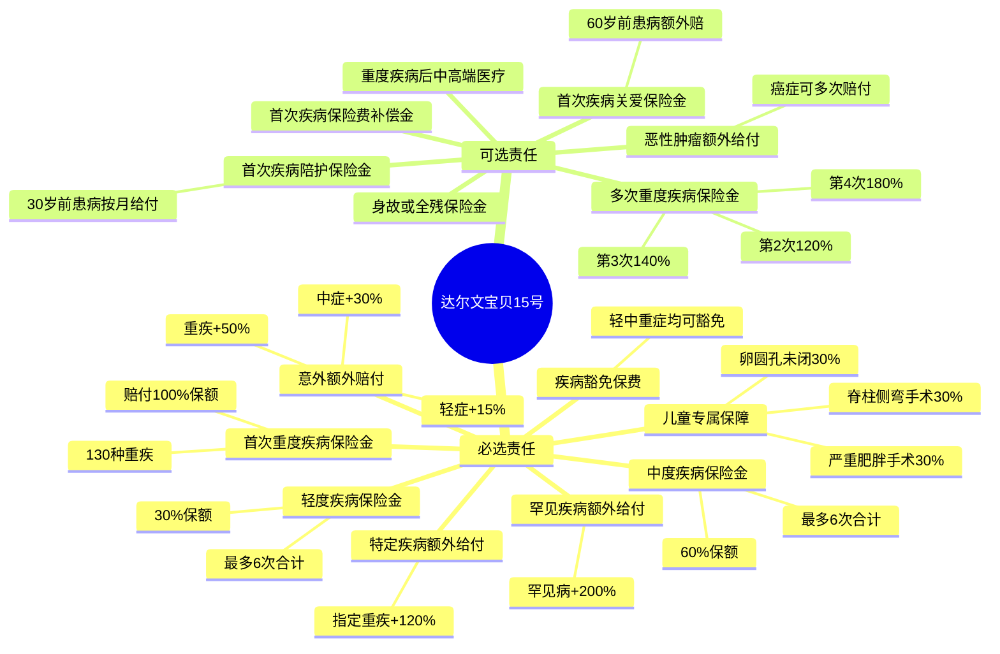
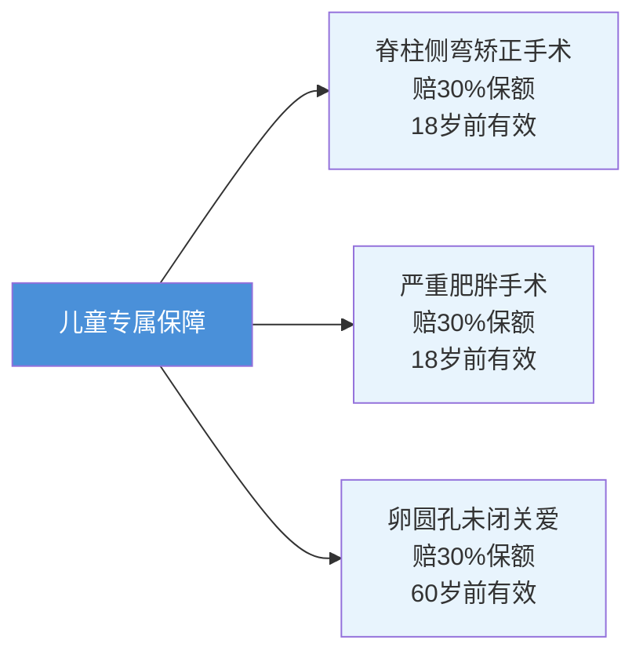
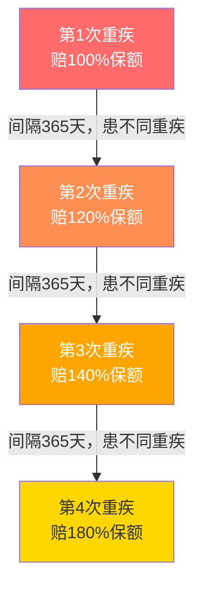
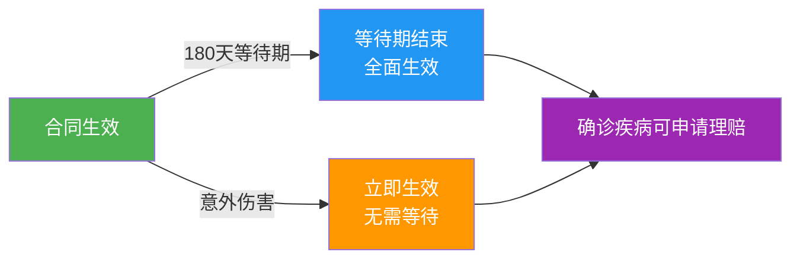
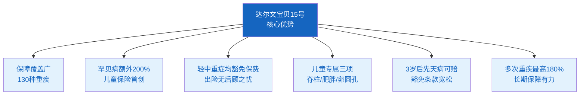

## 先聊聊：为什么孩子也要买重疾险？

很多父母觉得，孩子正处于人生中最健康的阶段，买保险是"浪费钱"。

但现实往往会给我们一记闷棍：

- 白血病、淋巴瘤……儿童恶性肿瘤的发病率并不低，而且治疗费用动辄几十万；
- 先心病手术、肾病综合征、脑炎后遗症……这些病在0-17岁高发，家庭积蓄很可能被一场大病清空；
- 孩子小时候保费最便宜，体况最好，这是买保险的黄金窗口期。

**一旦孩子长大后健康出了问题，再想买，可能已经过了投保年龄，或者被拒保、加费。**

所以，趁孩子健康的时候，给他们配上一份好的重疾险，是真正负责任的父母能做的事。

---

## 这款产品是什么来头？

**达尔文宝贝计划15号重大疾病保险**，全名是「信美相互互联网星辰守护D款少儿重大疾病保险」，由**信美人寿相互保险社**承保，通过慧择保险经纪在互联网上销售。

信美人寿是国内唯一的相互制寿险公司——也就是说，买了保险的人同时也是公司股东，有投票权、盈余分配权，结构上天然更注重保户利益。

达尔文宝贝系列已经迭代到第15代，经过多轮升级，这一代在保障宽度和深度上都达到了一个新高度。

---

## 产品基本信息一览

| 项目 | 内容 |
|------|------|
| 投保年龄 | 0岁（出生满28天）～17周岁 |
| 投保人年龄 | 18～80周岁（一般是孩子父母） |
| 保障期限 | D款：终身 / E款：至70岁 / F款：保30年 |
| 最低保额 | 10万元起，5万整数倍递增 |
| 最高保额 | 单产品累计≤100万，重疾险总计≤200万 |
| 等待期 | 180天（意外伤害无等待期） |
| 犹豫期 | 15天（可无条件退保，全额退费） |
| 保费缴纳 | 趸交（一次付清）或10/20/30/35年分期 |
| 承保机构 | 信美人寿相互保险社 |

> **小贴士**：2026年6月30日前投保，0-6岁最高可免体检投保70-100万（按地区），7-17岁最高100万。超过60万需提供健康资料。

---

## 核心保障：一张图看懂

---

## 必选责任逐条拆解

### 1. 首次重度疾病保险金 —— 核心

> **一旦确诊130种重疾之一，赔付100%保额，一次性到账。**

130种重疾里，前28种是银保监会规定的标准重疾（包括恶性肿瘤、心梗、脑中风、器官移植等），后102种是达尔文自己扩展的疾病，覆盖了很多儿童高发但行业标准里没有的病种。

**需要注意：**
- 确诊后，身故保险金（若勾选）同时终止，二者只取其一；
- 确诊后现金价值归零，但保费豁免责任还在；
- 等待期（180天）内确诊，退回已交保费，合同终止。

---

### 2. 中度疾病保险金 —— 60%

> **确诊中症，赔60%保额；每种病只赔一次，轻中症合计最多赔6次。**

中症是指比轻症严重、但还没到重症程度的疾病状态。比如较轻程度的心肌梗死、原位癌手术后、轻度脑中风等。

有一个细节要注意：**如果同一次生病，同时符合重症和中症的标准，只按金额更高的那项赔付。** 这是行业通行规则，达尔文也一样。

---

### 3. 轻度疾病保险金 —— 30%

> **确诊轻症，赔30%保额；同样纳入6次累计限制。**

轻症通常是一些早期病变或相对较轻的手术，比如甲状腺结节手术、不符合重疾标准的心脏手术等。

**豁免保费是个大亮点**：不管是轻症、中症、还是重症，只要确诊了，从确诊日起，后续所有保费都由保险公司替你交。也就是说，孩子出险了，保险不但赔钱，还继续帮你把保险维持下去。

---

### 4. 意外伤害额外给付 —— 最高+50%

> **如果是意外（车祸、意外摔伤等）导致的重疾/中症/轻症，在正常赔付基础上额外多赔一笔。**

| 情形 | 额外赔付 | 触发次数 |
|------|----------|----------|
| 意外导致首次重疾 | +50%保额 | 1次 |
| 意外导致首次中症 | +30%保额 | 1次 |
| 意外导致首次轻症 | +15%保额 | 1次 |

举个例子：保额50万，孩子因意外事故确诊了重疾，最终可以拿到 **50万（重疾）+ 25万（意外额外）= 75万**。

---

### 5. 首次特定疾病保险金 —— 额外+120%

> **在重疾赔付的基础上，如果是特定疾病，还能再拿120%保额。**

特定疾病是合同里单独列出的一组高危、高花费疾病，比如：
- 严重脑中风
- 严重心肌梗死
- 恶性肿瘤等

以50万保额举例：患了特定重疾，可获得 **50万（重疾）+ 60万（特定疾病额外）= 110万**。

---

### 6. 首次罕见疾病保险金 —— 额外+200%

> **如果确诊的是罕见病，在重疾赔付基础上，再拿200%保额。**

罕见病治疗费用极高，很多一年就要几十万上百万。这项责任专门为此设计。

以50万保额举例：患了罕见重疾，可获得 **50万（重疾）+ 100万（罕见病额外）= 150万**。

---

### 7. 儿童专属三项保障

这三项是达尔文宝贝系列专门为0-17岁孩子设计的，市场上很少有产品覆盖：

**脊柱侧弯**：中小学生高发！因为脊柱弯曲严重需要手术矫正的，直接赔30%保额。  
**严重肥胖**：因肥胖并发症（如糖尿病、高血压）需要减重代谢手术的，赔30%保额。  
**卵圆孔未闭**：这是一种先天性心脏缺陷，因此导致重疾的，在重疾赔付基础上额外再赔30%。

---

## 可选责任解析

可选责任需要在投保时勾选，保费会相应增加。

### 多次重度疾病保险金 —— 最值得加！

> **要注意**：每次赔付的必须是"不同种类"的重疾，且相邻两次确诊需间隔365天以上。

以50万保额为例，如果孩子一生中不幸患了4次不同的重疾：
- 第1次：50万
- 第2次：60万（120%）
- 第3次：70万（140%）
- 第4次：90万（180%）
- **合计最多可获赔：270万**

---

### 恶性肿瘤额外给付 —— 专门对抗癌症

> 首次重疾是癌症后，相隔365天再次确诊癌症（复发、转移、新发），还能继续赔付。

| 次数 | 赔付比例 | 间隔要求 |
|------|----------|----------|
| 首次癌症额外 | 40%保额 | 距上次诊断≥365天（或首次非癌症重疾后≥180天） |
| 第2次癌症额外 | 50%保额 | 距上次≥365天 |
| 第3次癌症额外 | 30%保额 | 距上次≥365天 |
| 第4次及以后 | 每次50%保额 | 距上次≥3年 |

癌症是重疾中发生率最高的一类，这项可选责任能有效应对癌症长期治疗的高额费用。

---

### 首次疾病关爱保险金 —— 60岁前患病，额外再赔一笔

> 在孩子未满60岁时确诊疾病，在正常赔付基础上，再给一笔"关爱金"。

| 疾病等级 | 关爱金额度 | 叠加在哪里 |
|----------|------------|------------|
| 首次重疾 | +100%保额 | 叠加在首次重疾赔付上 |
| 首次中症 | +50%保额 | 叠加在中症赔付上 |
| 首次轻症 | +10%保额 | 叠加在轻症赔付上 |

举个极端例子：50万保额，孩子30岁患了特定重疾，叠加关爱金后：
- 重疾：50万
- 特定疾病额外：60万（120%）
- 关爱金：50万（100%）
- **合计：160万**，只用了一份保险。

---

### 首次疾病陪护保险金 —— 按月给钱，陪孩子治病

> 孩子未满30岁时确诊，确诊当月起每月额外给一笔陪护金，最多给6个月。

| 疾病等级 | 每月陪护金 | 最多领取 |
|----------|------------|----------|
| 首次重疾 | 5%保额/月 | 6次（30%保额） |
| 首次中症 | 2%保额/月 | 6次（12%保额） |
| 首次轻症 | 1%保额/月 | 6次（6%保额） |

这笔钱是为了覆盖**父母陪护期间的误工损失、交通住宿费用**——毕竟孩子生病，父母往往要请假或辞职陪护，这是现实中非常真实的损失。

---

### 身故或全残保险金

> 如果孩子因意外或疾病身故或全残，按以下标准赔付：

- **18岁前**：退还已缴保费（未成年身故有国家规定的最高限额）
- **18岁后**：赔付100%保额

**注意**：首次重疾保险金和身故/全残保险金只能赔其中一项，不能叠加。

---

### 重度疾病后中高端医疗

> 首次重疾确诊后，还能享受一定额度的中高端医疗报销，覆盖国内顶级医院的自费项目。

- 首年报销上限：50%保额
- 累计报销上限：100%保额
- 报销比例：经社保结算100%，未经社保结算80%

这相当于**重疾险+医疗险的双重保障**，确诊后治疗费用可以多一条报销通道。

---

## 不赔的情况（责任免除）

没有什么保险是"包赔一切"的，以下情况不在保障范围内：

| 免除情形 | 说明 |
|----------|------|
| 投保人故意伤害被保险人 | 保险公司退还现金价值 |
| 被保险人故意犯罪 | 不赔，退现金价值 |
| 2年内自杀（精神障碍除外） | 不赔 |
| 服用毒品 | 不赔 |
| 酒驾、无证驾驶 | 不赔 |
| 战争、核辐射 | 不赔 |
| 艾滋病（特殊情况有例外） | 不赔 |
| 遗传病、先天性畸形（有例外） | **3岁后确诊且已如实告知的，可赔** |

最后一条特别值得关注：

> ✅ **如果孩子是3岁之后才被确诊为遗传性疾病或先天性异常，且投保前已如实告知，保险公司**仍然承担重疾赔付责任**。** 这比很多同类产品的免除条款宽松很多。

---

## 等待期怎么算？

**等待期内确诊疾病会怎样？**
- **重疾/身故全残**：退回已缴保费，合同终止
- **中症/轻症**：该项责任直接终止，其他责任继续有效
- **意外伤害**：无等待期，确诊即可理赔

---

## D/E/F 三款怎么选？

| 方案 | 保障期限 | 适合人群 | 特点 |
|------|----------|----------|------|
| **D款（推荐）** | 终身 | 预算充足、追求终身保障 | 保到死，现金价值稳步积累 |
| E款 | 至70周岁 | 预算一般，希望保到老年 | 保费略低于D款 |
| F款 | 保30年 | 预算有限，重点保护成长期 | 保费最低，30年后保障结束 |

**我的建议**：优先考虑D款（终身）。人生后半段才是重疾高发期，如果只保到70岁或30年，在最需要保障的阶段反而没有覆盖，有点可惜。而且孩子越早买，保费越便宜，早锁定终身保障更划算。

---

## 保费大概多少钱？

根据合同样本（14岁男孩，10万保额，趸交），一次性缴费约19,166元，折合每年约1,369元。

实际保费会根据**孩子年龄、性别、保额、缴费期限、所选责任**不同而有所差异。一般规律：
- 年龄越小，保费越低
- 女孩比男孩便宜（女性重疾发病率相对不同）
- 分期缴比趸交总保费略高，但减轻当期现金压力

---

## 这款产品好在哪里？

---

## 需要留意的地方

1. **等待期180天**：合同生效后半年内患病不赔（意外除外），不是缺点，是行业标准，只是需要心理准备；
2. **多次重疾需不同种类**：第2次重疾必须和第1次是"不同疾病"，同一种病复发不适用多次赔付（癌症额外责任例外）；
3. **陪护金和关爱金有年龄限制**：陪护金要求确诊时未满30岁，关爱金要求未满60岁，超龄失效；
4. **中症/轻症累计上限6次**：轻中症合计只赔6次，用完即止；
5. **身故和重疾只赔一项**：选了身故责任的话，要明白重疾和身故二择一。

---

## 常见问题

**Q：孩子已经有社保了，还需要买重疾险吗？**

A：社保只报销医疗费用（还有比例限制），不赔失能损失和护理费用。重疾险是直接给付现金，孩子生病期间父母无法工作的损失、后续康复费用、生活品质的维持，都需要这笔钱来覆盖。两者互补，不能替代。

**Q：孩子有过湿疹/过敏/发育问题，能投保吗？**

A：轻微的湿疹、过敏、感冒发烧史通常不影响投保。如果有既往病史，建议如实告知，由核保人员评估。部分情况可能加费承保或除外特定疾病，但仍然值得尝试。

**Q：投保后孩子被查出有先天性心脏病，能赔吗？**

A：如果是在投保前未如实告知的，保险公司有权拒赔并解除合同。但如果投保前已告知，且核保通过，或者是孩子3岁后才被诊断出来，且该先天病符合合同定义的重疾，是可以赔付的。

**Q：买了D款（终身）后可以退保吗？**

A：可以。犹豫期（15天）内退保，全额退费不扣钱。犹豫期后退保，按现金价值退还，会有一定损失。购买前请仔细考量，长期重疾险不建议轻易退保。

---

## 小结

达尔文宝贝15号是市场上**综合保障能力较强的少儿重疾险之一**，特别适合：

- ✅ 希望一次性把孩子保障配齐的父母
- ✅ 家庭中有遗传病史的（3岁后的先天病宽松处理）
- ✅ 追求终身保障、不想年年续保的家庭
- ✅ 预算充足，想给孩子配置罕见病、癌症等高额保障的

保险是给孩子最踏实的礼物之一。趁着孩子年龄小、身体好，尽早锁定。

---

> 如需了解具体保费或为孩子量身规划保障方案，欢迎留言或联系咨询。  
> 本文内容基于信美人寿相互保险社官方条款整理，具体以合同为准。
