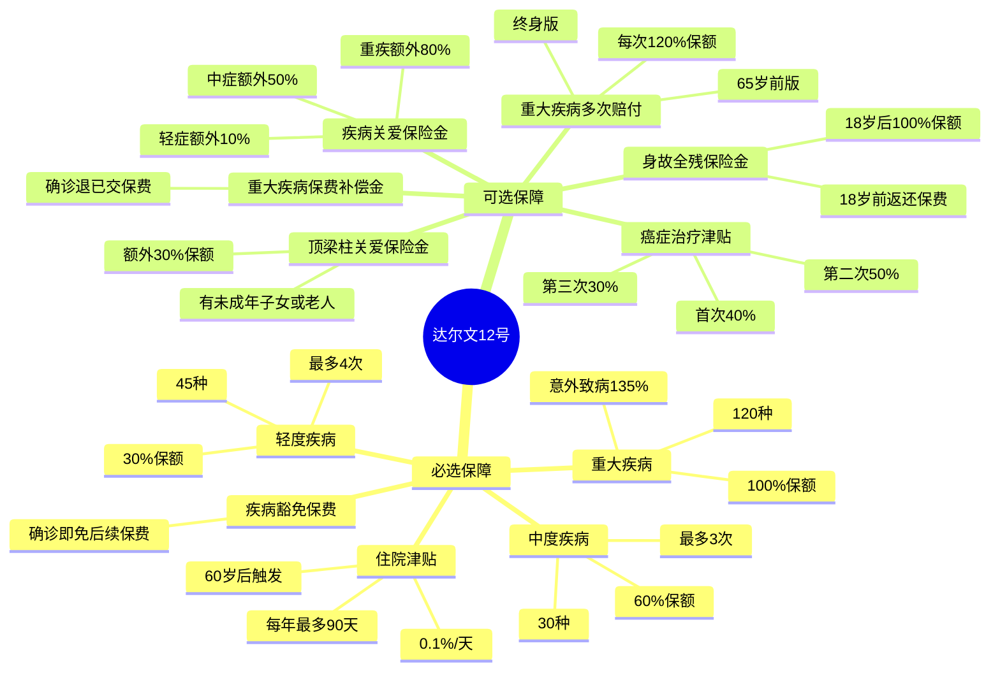
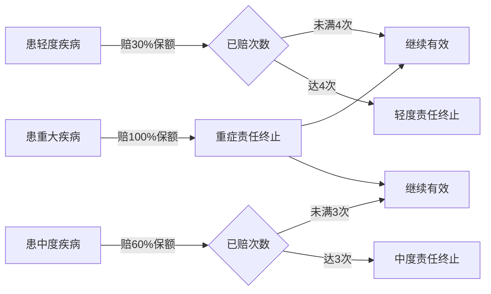
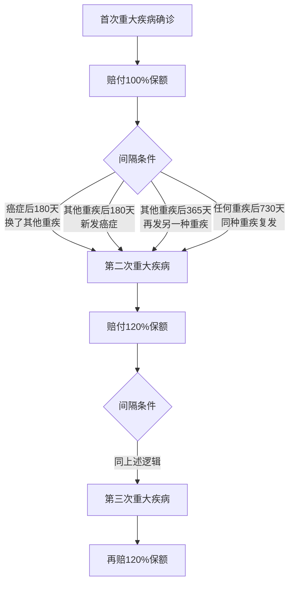
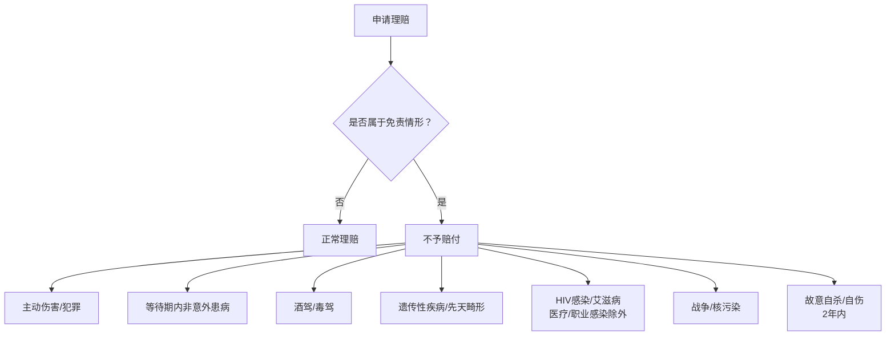
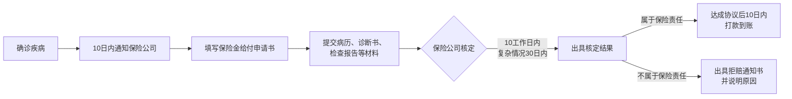

## 先问你一个扎心的问题

如果你明天被确诊癌症，你家的存款，能撑多久？

我不是要吓你。只是想让你算一笔账：

- 肺癌靶向药，一个月大概 1~3 万；
- 白血病骨髓移植，动辄 40~80 万；
- 脑中风后的康复治疗，可能要持续几年，每年十几万；
- 更别说你在治病期间，收入可能直接归零……

这还没算上你家的房贷、孩子的学费、父母的赡养费。

**重大疾病，打垮的不只是身体，是整个家庭的现金流。**

而重疾险，本质上就是在灾难来临前，帮你提前准备好一笔"救命钱"。

今天我们聊的这款产品，叫做**达尔文12号**，全名是**复星联合优选K重大疾病保险（互联网）**，出自复星联合健康保险——国内重疾险的标杆选手之一。

---

## 这款产品是什么来头？

**复星联合健康保险**，是复星国际旗下的专业健康险公司，成立于2017年，虽然年轻，但达尔文系列重疾险已经是市场上口碑最好的产品线之一。

从"达尔文1号"一路迭代到现在的"达尔文12号"，每一代都在加宽保障、加深细节。

这一代的亮点，用一句话总结就是：

> **保的病种最多，赔的档次最细，赔付比例在同类里也是上乘。**

下面我带你一块块拆开来看。

---

## 这款保险，到底保什么？

### 保障体系全景图

先给你看一张整体框架图，建立第一印象：

---

### 一、必选保障（买就有，不用多花钱）

#### 1. 重大疾病保险金 —— 核心中的核心

**保什么**：120种重大疾病，从癌症、心肌梗死、脑中风，到器官移植、白血病……高发的、少见的，全都包了。

**赔多少**：
- 普通疾病导致：**赔 100% 保额**（比如买了50万保额，就赔50万）
- **意外伤害**导致：**赔 135% 保额**（有加成！）

**赔几次**：首次重大疾病只赔**一次**，赔完这项责任终止。

| 触发条件 | 赔付比例 |
|---------|---------|
| 非意外原因患病（等待期后） | 基本保额 × 100% |
| 意外原因导致的重大疾病 | 基本保额 × 135% |

> **白话解释**：意外摔伤导致脑损伤、或者车祸导致截肢，符合重大疾病定义的话，比普通生病多赔 35%，算是意外伤害的加成福利。

---

#### 2. 中度疾病保险金 —— 重疾之前的"预警网"

很多疾病刚确诊时，还没到"重症"的程度，但治疗费用已经不少了。中度疾病就是来解决这个问题的。

**保什么**：30种中度疾病，包括不符合重症标准的心肌梗死、轻度脑中风、早期肝硬化等。

**赔多少**：每次赔 **60% 保额**，最多赔 **3次**。

**特别规定**：就算你已经赔过重大疾病了，只要中度疾病赔付次数没达到3次，这项责任继续有效！也就是说，先患癌症（赔了重症），后来又确诊了中度疾病，**还能继续赔中度那份**。

---

#### 3. 轻度疾病保险金 —— 小病不"小"

轻度疾病通常是指刚刚发生、程度较轻的病变，比如轻度甲状腺癌、早期前列腺癌、原位癌等。

**保什么**：45种轻度疾病

**赔多少**：每次赔 **30% 保额**，最多赔 **4次**

> **举个例子**：你买了50万保额，先确诊轻度甲状腺癌，赔 15万；几年后又确诊早期乳腺原位癌，再赔 15万——两次都能赔，互不影响。

---

#### 4. 住院津贴保险金 —— 退休后的"零花钱"

这个设计挺有意思的，专门给60岁以后的老年阶段准备：

**触发条件**：
- 60岁前没有确诊过重大疾病
- 60岁后因病需要住院

**赔多少**：每住院1天，赔 **0.1% 保额**

**上限**：每年最多赔 **90 天**，总计不超过保额的 **100%**

> **举个例子**：买50万保额，60岁后因肺炎住院30天，赔 50万 × 0.1% × 30 = **1.5万元**。

注意：一旦赔过住院津贴，后续赔重大疾病时会**扣减**已领津贴金额。

---

#### 5. 疾病豁免保险费 —— 最温暖的设计

只要你确诊了轻度、中度或重大疾病，保险公司**豁免你后续所有应交的保费**，保险继续有效。

> **白话翻译**：你生病了，不用再交钱，但保险还在保你。这对于30年缴费的客户来说，相当于省了一大笔钱，还能继续享受后续的中度、轻度赔付。

---

### 二、可选保障（根据自身情况选择）

#### 可选1：身故或全残保险金

| 年龄段 | 赔付内容 |
|--------|---------|
| 18岁以下 | 退还已缴纳的全部保费（不含豁免部分） |
| 18岁及以上 | 给付 100% 基本保额 |

> **适合人群**：家庭支柱、有贷款、有需要赡养的老人或小孩的人。

---

#### 可选2：疾病关爱保险金 —— 60岁前额外福利

**仅限60岁前**初次确诊，在原有赔付基础上**额外给付**：

| 疾病等级 | 额外赔付 | 加上基础赔付 | 合计 |
|---------|---------|------------|------|
| 重大疾病 | +80% 保额 | 100% | **180% 保额** |
| 中度疾病 | +50% 保额 | 60% | **110% 保额** |
| 轻度疾病 | +10% 保额 | 30% | **40% 保额** |

> **白话**：60岁前得了癌症，不是赔50万，而是赔 **90万**（50万保额 × 180%）！这个关爱金只给付一次，先到先得。

---

#### 可选3：重大疾病多次赔付 —— 得了两次，赔两次

有两个版本可选其一：

**方案A：65岁前版**
- 65岁前发生第一次重大疾病后，间隔365天，再确诊**另一种**重大疾病，赔 **120% 保额**
- 或者间隔1095天，确诊**同一种**重大疾病复发，也赔 **120% 保额**

**方案B：终身版**（更强）

> **举例**：50万保额，先患心肌梗死赔50万；2年后又患癌症，再赔60万；过了几年癌症仍持续或复发，再赔60万。**三次合计赔付170万！**

---

#### 可选4："恶性肿瘤——重度"治疗津贴 —— 专为癌症设计

癌症是最怕"持续消耗"的病，这个责任就是为长期抗癌的人设计的：

| 阶段 | 触发条件 | 赔付比例 |
|------|---------|---------|
| 首次治疗津贴 | 确诊癌症并赔付重症保险金后，365天后仍处于癌症状态 | 40% 保额 |
| 第二次治疗津贴 | 首次津贴赔付后，再间隔365天仍处于癌症状态 | 50% 保额 |
| 第三次治疗津贴 | 第二次津贴赔付后，再间隔365天仍处于癌症状态 | 30% 保额 |

> **50万保额举例**：得癌症赔50万 → 1年后还在抗癌赔20万 → 再过1年赔25万 → 再过1年赔15万 = **合计赔110万！**

---

#### 可选5：重大疾病保费补偿金 —— 确诊退保费

在交费期满前确诊重大疾病，保险公司**退还你已经交过的所有保费**（不含豁免部分）。

> **白话**：你已经交了10年保费共10万，现在确诊了癌症，除了赔保额，还额外退给你10万"学费"。

---

#### 可选6：顶梁柱关爱保险金 —— 有家有口人的专属

**触发条件（同时满足）**：
- 初次确诊"恶性肿瘤——重度"
- 确诊当日，有**未满18岁的子女**（亲生/养/继）在世，或有**已满60岁的父母**在世

**赔付**：额外给付 **30% 保额**

> **白话**：得了癌症，还要养娃、养老，保险公司额外再给你一笔钱，帮你撑住家庭这根顶梁柱。

---

## 这款产品，保的是哪些病？

### 120种重大疾病（前10高发病种）

| 序号 | 疾病名称 | 说明 |
|------|---------|------|
| 1 | 恶性肿瘤（重度） | 各类癌症，最高发，最消耗金钱 |
| 2 | 较重急性心肌梗死 | 心脏病，猝死前的最后一道门 |
| 3 | 严重脑中风后遗症 | 半身不遂、言语障碍 |
| 4 | 重大器官移植术 | 心肝肾肺等器官移植 |
| 5 | 冠状动脉搭桥术 | 心脏大手术 |
| 6 | 严重慢性肾衰竭 | 需要终身透析 |
| 7 | 多个肢体缺失 | 截肢 |
| 8 | 严重非恶性颅内肿瘤 | 良性脑瘤但需手术/放疗 |
| 9 | 严重慢性肝衰竭 | 肝功能严重受损 |
| 10 | 严重脑炎/脑膜炎后遗症 | 留下神经系统损伤 |

> 另外还有深度昏迷、双耳失聪、双目失明、瘫痪、阿尔茨海默病、帕金森病等110种，几乎把人生中可能遭遇的所有重大健康风险都纳入了。

---

## 有哪些情况不赔？

任何保险都有免责条款，这部分一定要看清楚：

**重点说两个常见的：**

1. **等待期（180天）**：生效后180天内，因非意外原因患重大疾病，**不赔，只退保费**。意外伤害导致的无等待期。
2. **遗传性疾病、先天性畸形**：从娘胎里带来的疾病不保。这也是大多数重疾险的通行规则。

---

## 理赔流程，怎么操作？

**理赔需要的材料**：
- 本人有效身份证件
- 医疗机构出具的**疾病诊断证明书**（必须附病历、病理报告、血液检验等）
- 相关手术记录、出院小结等

---

## 买之前，这几个问题想清楚

### Q1：等待期180天是什么意思？

从保险生效起，**前180天买了保险但不保非意外疾病**。这180天内如果因为疾病患了重大疾病，保险公司退还已交保费，合同终止。

**意外伤害没有等待期**，比如今天买，明天发生车祸导致截肢，可以直接理赔。

### Q2：买多少保额合适？

一般建议：**至少30万，有条件买50万起步**。

根据原则：保额要能覆盖你治病+康复的费用，还要能补偿你丧失的2~3年收入。

比如你月收入1万，治疗费用预计30万，康复期2年——那至少需要 **50万保额**。

### Q3：犹豫期是什么？

购买后 **15天内，如果觉得不合适，可以无条件退保，保险公司无息退还全部保费**。

这15天是你的"后悔药"期，好好阅读条款，想清楚再决定。

---

## 一张表看清楚：如果我买了50万保额，各种情况能赔多少？

| 场景 | 涉及责任 | 赔付金额（50万保额） |
|------|---------|-------------------|
| 60岁前确诊癌症（仅基础版） | 首次重大疾病 | **50万** |
| 60岁前确诊癌症 + 疾病关爱 | 重疾 + 关爱金 | **90万**（180%） |
| 意外导致癌症 | 重疾135%赔付 | **67.5万** |
| 先心梗，3年后再发不同重疾 | 重疾 + 多次赔付终身版 | **50万 + 60万 = 110万** |
| 癌症持续3年 + 津贴险 | 重疾 + 三次津贴 | **50万 + 10万 + 12.5万 + 7.5万 = 80万** |
| 轻症确诊 + 豁免保费 | 轻度疾病金 + 免后续保费 | **15万 + 豁免N万保费** |
| 60岁后因病住院90天 | 住院津贴 | **50万 × 0.1% × 90天 = 4.5万** |

---

## 最后，说几句掏心话

保险这东西，平时感觉没用，真正用到的时候，你会庆幸自己买了。

达尔文12号的设计逻辑，是**"阶梯式赔付 + 多次赔付"**——覆盖你从小毛病到大毛病的全过程，不是确诊就结束，而是陪你抗争到底。

- 轻症赔，让你不用为"不够严重"而纠结；
- 中症赔，填补重症和轻症之间的空白；
- 重症赔，给你最大的现金支持；
- 多次赔付，让你不怕第二次打击；
- 豁免保费，让你专心治病不担心钱。

这不是花哨的噱头，是真正站在投保人角度设计的保障体系。

**身体好的时候，是买保险最好的时机。**

不要等到用保险的那天，才后悔今天没有行动。

---

## 附：产品核心信息汇总

| 项目 | 详情 |
|------|------|
| 产品名称 | 复星联合优选K重大疾病保险（互联网）/ 达尔文12号 |
| 保险公司 | 复星联合健康保险股份有限公司 |
| 保险期间 | 终身 / 保至70周岁（可选） |
| 重大疾病 | 120种，赔100%保额（意外135%） |
| 中度疾病 | 30种，赔60%保额，最多3次 |
| 轻度疾病 | 45种，赔30%保额，最多4次 |
| 等待期 | 180天（意外无等待期） |
| 犹豫期 | 15天（无息退保） |
| 保费豁免 | 确诊轻/中/重症后豁免后续保费 |
| 客服热线 | 4006-11-7777 |
| 官方网站 | www.fosun-uhi.com |

---

> **免责声明**：本文内容基于保险条款整理，仅供参考。具体条款以保险合同为准，购买前请仔细阅读投保须知和保险条款，或咨询专业顾问。
