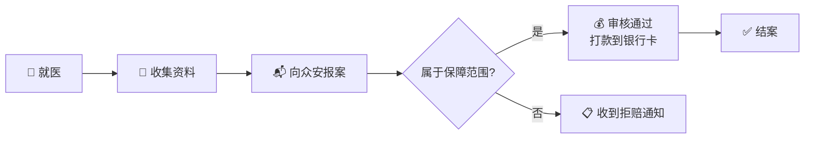


<a href="/pages/zhongan-zunxiang-esheng-2026/" target="_blank" style="display:block;margin:0 0 28px;padding:16px 20px;background:linear-gradient(135deg,#0d1b2e,#0a1628);border:1px solid rgba(79,172,254,0.35);border-radius:14px;text-decoration:none;color:inherit;">
  <div style="font-size:11px;color:#4facfe;font-weight:600;letter-spacing:.5px;margin-bottom:6px;">📊 互动版保障详解</div>
  <div style="font-size:16px;font-weight:700;color:#fff;margin-bottom:4px;">众安尊享e生2026版 · 完整责任解析 H5 页面</div>
  <div style="font-size:13px;color:rgba(255,255,255,0.55);">8大责任 · 赔付场景测算 · 先进疗法详解 · 理赔流程 → 点击查看精美互动版</div>
</a>


## 先问你一个问题

你去年的医疗账单，自己掏了多少钱？

不是我吓你。2025年国家卫健委的数据：全国三级公立医院次均住院费用已经超过**1.4万元**。如果是癌症——肺癌靶向药一个月1~3万，CAR-T一针120万，质子重离子一个疗程30万……

**社保能报多少？** 甲类药100%报销，乙类药报70%~80%，但丙类药（自费药）一分不报。而大多数抗癌药、进口药，都是丙类。

百万医疗险，就是用来填这个坑的。

今天聊的这款——**众安尊享e生·百万医疗保险2026版**（条款名：个人医疗保险互联网2025版），来自**众安在线财产保险**——国内百万医疗险的开创者。从2016年第一款"尊享e生"上市到现在，这个系列累计服务了超过7000万用户。

2026版到底升级了什么？我用一句话说清楚：

> **外购药械全覆盖、三种先进癌症疗法全包、100种重疾0免赔——百万医疗险的"天花板"又抬高了。**

---

## 保障全景：一张图看懂八大责任

这款产品的保障责任，一共**8项**——7项必选 + 1项可选。下面这张脑图，帮你30秒看懂全部：

```mermaid
mindmap
  root((尊享e生2026<br/>八大保障))
    必选责任
      (一)一般医疗及外购药械
        住院医疗
        特殊门诊
        门诊手术
        住院前后门急诊
        外购药品和器械
      (二)重疾医疗及外购药械
        100种重大疾病
        含门急诊医疗
        外购药品和器械
      (三)特定疾病康复住院
        16种特定疾病
        180天内康复治疗
      (四)特定药品费用
        抗癌特药+基因检测
        罕见病特药
        临床急需进口药
        指定疾病急需药
      (五)恶性肿瘤先进疗法
        质子重离子治疗
        硼中子俘获治疗
        光免疫疗法
      (六)重疾异地转诊
        公共交通费用
        住宿费用
      (七)重疾住院护工
        日津贴给付
        最高30天
    可选责任
      (八)一般门急诊及外购药械
        门急诊医疗
        外购药品和器械
```

**一句话总结：从住院到门诊、从境内药到进口药、从普通治疗到全球顶尖癌症疗法——这张保单全部覆盖。**

---

## 必选责任，逐条拆解

### (一) 一般医疗及外购药械费用医疗保险金

这是最核心、使用频率最高的责任。保什么？**5类费用**：

| 费用类型 | 白话解释 |
|---------|---------|
| 住院医疗费用 | 床位费、护理费、ICU费、检查费、药费、手术费、救护车费、**手术机器人使用费** |
| 特殊门诊医疗费用 | 肾透析、癌症门诊放化疗、器官移植后抗排异 |
| 门诊手术医疗费用 | 不需要住院的手术 |
| 住院前后门急诊 | 住院前30天 + 出院后30天的门急诊 |
| 外购药品及外购医疗器械 | 医生开处方，但医院没有药，需要去外面药店买的——**这项也赔** |

> ⭐ **亮点1：外购药械覆盖到一般医疗！** 大多数百万医疗险只覆盖癌症特药的外购，而这款连一般疾病住院的外购药械都保。什么意思？比如你住院需要一种抗生素，医院药房没有，医生开处方让你去院外药店买——这笔钱，它赔。

---

### (二) 重大疾病医疗及外购药械费用医疗保险金

如果确诊了合同约定的**100种重大疾病**（恶性肿瘤——重度、急性心梗、脑中风后遗症等），这一项责任就启动了。覆盖的费用类似上面，但有**三个升级**：

| 升级点 | 说明 |
|--------|------|
| **多一类：重疾门急诊** | 不仅住院前后，日常因重疾去门急诊的费用也赔 |
| **最高赔付额度独立** | 与一般医疗分开计算，不互相挤占 |
| **100种重疾定义** | 符合中国保险行业协会2020版重疾定义规范 |

---

### (三) 特定疾病康复住院费用医疗保险金

这个责任很多百万医疗险没有。保的是**16种特定疾病**在初次确诊后180天内的康复住院治疗费。

16种特定疾病分为四类：

| 类别 | 疾病 |
|------|------|
| 肿瘤类（2种） | 恶性肿瘤——重度、脑/脊髓肿瘤切除术后 |
| 神经系统类（7种） | 脑卒中、颅脑损伤、脊髓损伤、帕金森、阿尔茨海默病、缺血缺氧性脑病、脑炎/脑膜炎后遗症 |
| 心肺系统类（5种） | 冠心病、心脏手术术后、慢性呼吸衰竭、重症肺炎、慢性阻塞性肺疾病 |
| 骨骼关节类（2种） | 严重骨折、关节置换手术 |

> 这些东西康复起来周期极长。比如脑卒中后的康复，可能要几个月甚至一两年。这笔钱，百万医疗险一般是不赔的——但尊享e生2026赔。

---

### (四) 特定药品费用医疗保险金

**这是整张保单最亮眼的责任之一**，包含四个子项：

```
特定药品费用医疗保险金
├── 1. 抗癌特药 + 基因检测
│   ├── 院外抗癌靶向药和免疫治疗药物
│   ├── 需在指定药店购买，保险公司直付（你不用垫钱）
│   ├── 含基因检测费用（不在指定机构做赔60%）
│   └── 保期结束后可延续30天
├── 2. 罕见病特药
│   ├── 国家罕见病目录内疾病
│   └── 指定药店直付
├── 3. 临床急需进口药品 + 指定医院住院
│   ├── 国内未上市但临床急需的进口药
│   ├── 在海南博鳌等指定医疗机构使用
│   └── 含在指定医疗机构的住院费用
└── 4. 指定疾病急需药品
    └── 特定急需药品，指定药店直付
```

> ⭐ **亮点2：药品种类最全。** 从国内已上市的抗癌药、到罕见病药、到国内还没上市但临床急需的进口药——四种类型全包。而且**保险公司和药店直接结算，你不需要先垫钱再报销**。

---

### (五) 恶性肿瘤先进疗法医疗保险金

这是2026版最"炸裂"的升级——**三种全球顶尖癌症疗法全部纳入**：

| 疗法 | 是什么 | 为什么厉害 |
|------|--------|-----------|
| **质子重离子治疗** | 用质子或重离子束精准打击肿瘤 | 对周围正常组织损伤极小，适合某些传统放疗难治的肿瘤 |
| **硼中子俘获治疗（BNCT）** | 向癌细胞输送硼，再用中子束照射，在癌细胞内"引爆" | 对浸润性、复发性肿瘤效果显著，目前全球仅极少数机构能做 |
| **光免疫疗法** | 用特异性抗体+近红外光精准杀死癌细胞 | 日本2022年刚获批，被称为"第五种癌症疗法" |

> ⭐ **亮点3：这三种疗法每一个都极其昂贵。** 质子重离子一个疗程约30万，硼中子俘获和光免疫更贵——传统医保一分不报。尊享e生2026把它们全放进必选责任里。

---

### (六) 重大疾病异地转诊公共交通费用及住宿费用保险金

如果因为重疾需要跨省治疗：

- **交通**：你和一名家属的客运公共交通费用（飞机限经济舱，火车限软卧或一等座）
- **住宿**：到达目的地后的住宿费（标准间），每天有给付限额，累计最多180天

---

### (七) 重大疾病住院护工费用保险金

因重疾住院，需要护工服务的：

- 扣除每次住院免赔天数后，按**日津贴额**给付
- 每次住院最高给付天数有限额
- 累计给付天数以**30天**为上限

---

## 可选责任：要不要加？

### (八) 一般门急诊医疗及外购药械费用医疗保险金

这是**唯一可选**的责任。保什么？

- 普通门急诊医疗费用（挂号、检查、药费、救护车）
- 门急诊对应的外购药品和器械

**适合谁加？**

| 人群 | 建议 |
|------|------|
| 小孩/老人（门诊频率高） | ✅ 强烈建议 |
| 有慢性病需要定期门诊开药 | ✅ 建议 |
| 年轻健康、很少看门诊 | ❌ 可以不选 |
| 预算紧张 | ❌ 优先必选责任 |

---

## 赔付流程：钱怎么拿到？



**关于免赔额**，用一个例子讲清楚：

> 假设你的免赔额是**1万元**。
>
> 第一次住院花了8000元（社保报销后自付部分）→ 免赔额还剩2000元，**本次赔付0元**。
>
> 第二次住院又花了5000元 → 免赔额抵扣完剩下的2000元，**本次赔付3000元 × 赔付比例**。
>
> 从此之后，该保险年度内**不再需要抵扣免赔额**，全部按比例赔付。

---

## 什么不赔？（责任免除精华版）

任何保险都有"不赔清单"。我把196页条款里的免责事项浓缩成了这几点：

| 类别 | 不赔内容 |
|------|---------|
| 🚫 违法行为 | 故意犯罪、酒驾、吸毒、无证驾驶 |
| 🚫 自带毛病 | 既往症、等待期内确诊的疾病、先天性/遗传性疾病 |
| 🚫 不必要医疗 | 医美/整容/减肥、牙科（意外除外）、近视矫正、非处方药、代诊/挂床 |
| 🚫 高风险活动 | 潜水、跳伞、攀岩、赛车、拳击等 |
| 🚫 生育相关 | 怀孕、流产、分娩、不孕不育治疗 |
| 🚫 试验性治疗 | 未经中国批准的药品、临床试验性治疗、基因疗法 |
| 🚫 海外就医 | 港澳台及境外治疗费用 |
| 🚫 艾滋病 | 除特定三种情形（职业暴露、输血、器官移植导致） |

> **最重要的两条**：① 既往症不赔——如果你投保前已经知道有病，这个病不保；② 等待期30天内确诊的疾病不赔。

---

## 投保须知

| 项目 | 内容 |
|------|------|
| 承保公司 | 众安在线财产保险股份有限公司 |
| 投保年龄 | 出生满30天 ~ 70周岁 |
| 续保年龄 | 最高可续至105周岁 |
| 保险期间 | 1年 |
| 保证续保 | **不保证续保**（每年需重新申请，经审核同意后续保） |
| 等待期 | 30天（意外伤害无等待期） |
| 犹豫期 | 15天（犹豫期内退保全额退款） |
| 宽限期 | 未按时交保费，有宽限期可补交 |

> ⚠️ **"不保证续保"是什么意思？** 如果产品停售，或者你的健康状况发生了明显变化（比如理赔了大额重疾），保险公司可能在下一年不再接受你的续保申请。这是百万医疗险的普遍特点——不是尊享e生独有的，但你需要知道。

---

## 和上一代比，2026版升级了什么？

| 维度 | 上代 | 2026版 |
|------|------|--------|
| 外购药械 | 仅重疾或特定药品 | **全部责任覆盖外购药械** |
| 先进疗法 | 质子重离子 | **质子重离子 + 硼中子俘获 + 光免疫** |
| 康复治疗 | 无 | **16种特定疾病康复住院** |
| 特定药品 | 抗癌药+罕见病药 | **四种药品全覆盖（+进口+急需）** |
| 门急诊 | 无 | **可选附加** |

---

## 适合谁买？

- ✅ 想要**全面医疗保障**的人——这款是百万医疗险里的"旗舰款"
- ✅ 担心**外购药自费负担**的人——它保外购药械的覆盖面行业领先
- ✅ 有**家族癌症史**的人——三种先进疗法保障是"杀手锏"
- ✅ 可能需要**跨省就医**的人——异地转诊交通住宿全包
- ⚠️ 极度看重"保证续保"的人——这款不保证续保，可以看看保证续保20年的长期医疗险

---

## 最后说两句

百万医疗险，本质上是一个**概率游戏**——你每年花几百块，赌的是万一。但当你真的需要它的时候，它就是那个"几百万的杠杆"。

尊享e生2026版，在我看来，做对了一件事：**它不只是"报销"你的医疗费，它在帮你打开更多治疗选择**——外购药、进口药、质子重离子、硼中子、光免疫……这些传统医保和普通医疗险碰不到的地方，它全部覆盖。

**风险这东西，从来不会提前打招呼。但你可以提前准备。**

---

> 📊 点击顶部的"互动版保障详解"卡片，可以查看包含保障脑图、赔付测算、病种清单、理赔流程的精美 H5 页面。手机上看效果更佳。

---

*本文基于《众安在线财产保险股份有限公司个人医疗保险条款（互联网2025版）》撰写，仅供参考。具体保障以保险条款和保单约定为准。*
